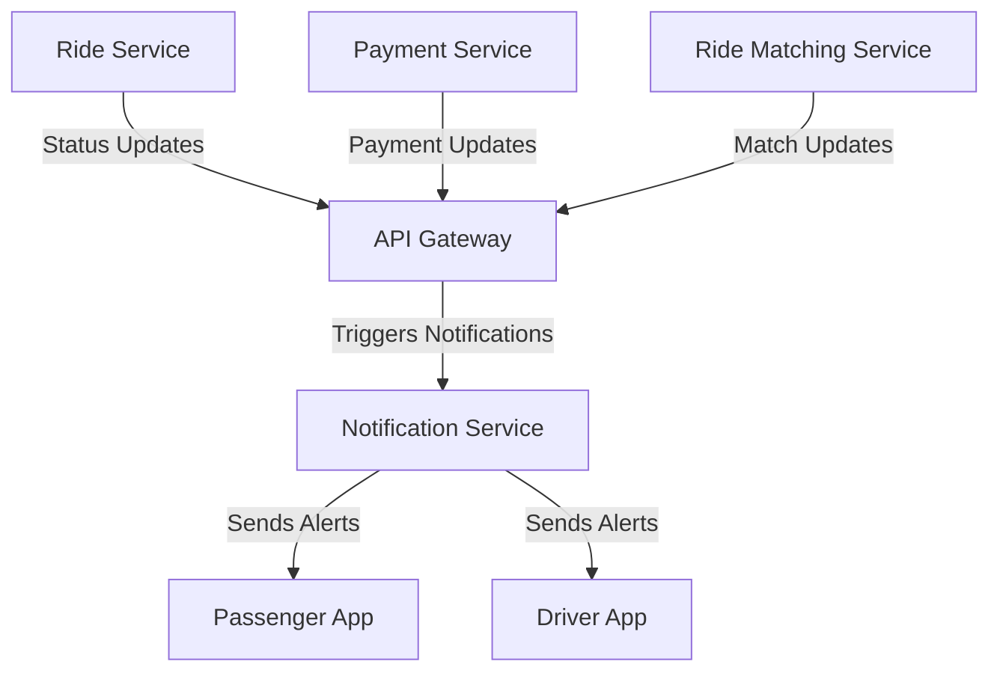

# Notification Service

The Notification Service manages real-time communication, sending push notifications for updates and alerts in the ride-booking system.

## Key Features
- Push Notifications
- Ride Status Alerts
- Payment Confirmations

## Recommended Tech Stack
- **Runtime**: Node.js for handling concurrent notifications [1][3].
- **Framework**: Socket.IO for real-time messaging [3].
- **Notification Tool**: Firebase Cloud Messaging for push alerts [7].
- **Database**: MongoDB for logging notification history [3].

## System Design Structure
- **Notification Engine**: Processes triggers for alerts.
- **Delivery Module**: Uses Firebase to send push notifications.
- **Queue System**: Manages high-volume notifications with Kafka [4].
- **Storage Layer**: Logs sent notifications for tracking.
- **API Handler**: Receives triggers via API Gateway.

## Architecture Diagram

## Interaction with Other Services
The Notification Service keeps users informed:
- **API Gateway**: Receives notification triggers.
- **Ride Service**: Sends ride status updates.
- **Payment Service**: Triggers payment alerts.
- **Ride Matching Service**: Notifies about matches.
- **Passenger App and Driver App**: Delivers notifications.

