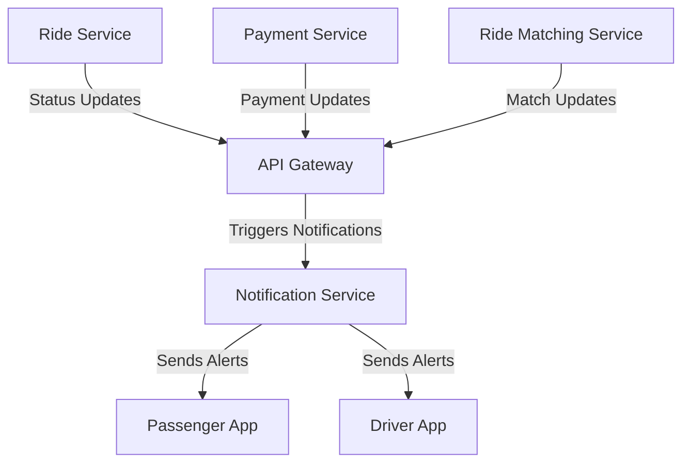

# Notification Service

The Notification Service is a microservice in the ride-booking system that manages real-time communication with users and drivers, sending push notifications for updates and alerts.

## Key Features
- **Push Notifications**: Sends instant updates via Firebase Cloud Messaging or similar tools.
- **Ride Status Alerts**: Notifies about ride acceptance, arrival, or completion.
- **Payment Confirmations**: Alerts users on successful transactions or issues.

## Architecture Diagram

## Interaction with Other Services
The Notification Service keeps users informed by collaborating with:
- **API Gateway**: Receives triggers for notifications from various services routed through the gateway.
- **Ride Service**: Sends ride status updates (e.g., driver assigned, ride started) to trigger notifications.
- **Payment Service**: Initiates alerts for payment confirmations or issues.
- **Ride Matching Service**: Triggers notifications for ride offers or successful matches.
- **Passenger App and Driver App**: Delivers notifications directly to client apps for real-time updates.

